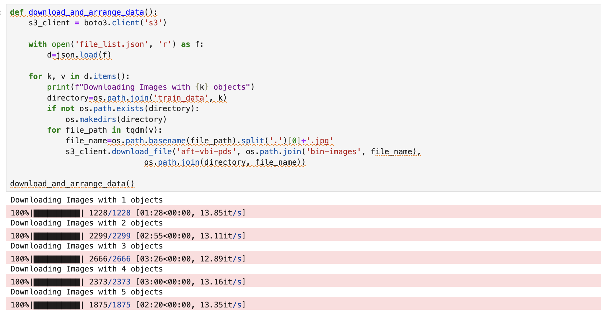
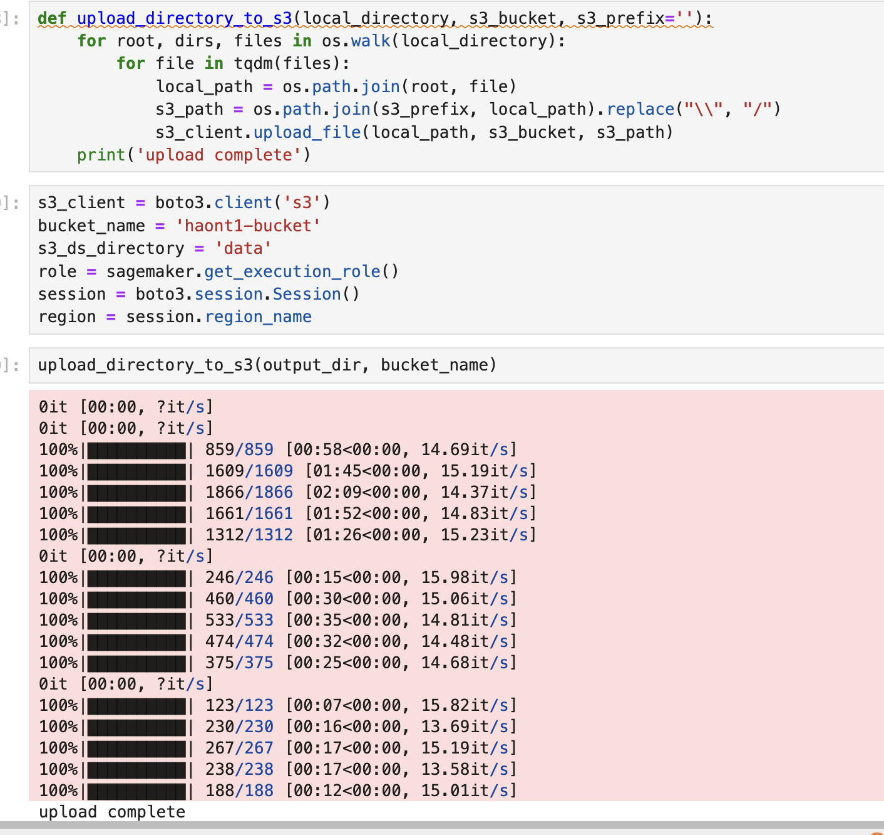
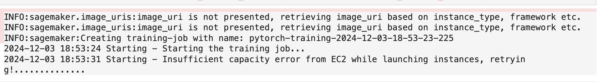

# Inventory Monitoring at Distribution Centers

Distribution centers are very important in the supply chain. They support the storage, sorting and dispatching the
products. The efficient operations of these centers are paramount to ensure timely deliveries, minimize costs and
maintain inventory accuracy. Before, inventory management based on manual process, which are prone to errors
and inefficiencies. Now, with automation and robotics, distribution centers can adopt robotic system to handle tasks
such as moving objects or managing bins etc..., and robots can automatically handle repetitive task than humans

The primary problem is we don’t have an automated, reliable system for counting the objects within each bin
managed by robots in distribution centers. This project aim to solve that problem. We will focus on develop a
machine learning model that can accurately classify the objects based on images data using the provided Amazon
Bin Image Dataset.

## Project Set Up and Installation
This project contains the following files and directories:

* **sagemaker.ipynb**: This is the main Jupyter Notebook instance that performs the end-to-end process for obtaining a model.
* **src/*.py**: Here are the files used by the `sagemaker.ipynb` notebook for train, evaluate...
* **ProfilerReport**: Contains the profiler report generated after training.

## Dataset

### Overview
The primary dataset for this project is the **Amazon Bin Image Dataset** which contains half a million bin’s images
containing objects. Each image is paired with metadata file detailing the number of objects, their dimensions and
types

Images show bins with varying numbers and types of objects, enhancing the model’s ability to
generalize across different scenarios


### Access
The notebook downloads every file from the list `file_list.json` locally and splits them in train, test, and validation datasets before uploading them into a bucket in S3 such as:



## Model Training
In this project, the **EfficientNet** model was chosen because its superior performance. EfficientNet uses a compound scaling method to balance width, depth, and resolution, which allows it to outperform many traditional architectures like ResNet on image classification tasks while being computationally lighter. The Efficient accuracy is better with fewer parameters and less computational overhead than Restnet50

Hyperparameters type:

* EfficientNet was initialized with weights pretrained on ImageNet to leverage learned feature representations. This significantly reduces training time and the risk of overfitting, especially on small datasets.
* While fine-tuning, all layers except the final classifier were frozen to retain the pretrained features and avoid overfitting in early layers. This allowed the model to focus on learning dataset-specific features in the classifier.
* A fully connected layer (nn.Linear) maps feature vectors to the number of output classes. Dropout (p=0.5) adds regularization and batch normalization improves stability and convergence. They all set to prevent overfitting and helps the model generalize well.

Evaluate the performance:

* Accuracy: EfficientNet (30%) > ResNet50 (29%)
* Precision: EfficientNet (0.35) > ResNet50 (0.30)
* Recall: EfficientNet (0.28) > ResNet50 (0.27)
* F1 Score: EfficientNet (0.28) > ResNet50 (0.25)

## Machine Learning Pipeline
This project pipline on the following:

* Data download: The dataset is downloaded to local then upload to S3, so other instances can use.
* Data transformation: The images were resized to 224x224 pixels and rotated randomly before training the model
* Model selection: Use a pre-trained EfficientNet as a baseline model. Hyperparameter tuning was performed with 5 jobs and then the best model was selected to be trained.
* Model training: the best model was trained and evaluated
* Debug and Profiling: a complete profiler report was obtained with relevant information such as GPU/CPU utilization and debugger information such as training loss was reported.
* Model deployment: Deploy the best model to a SageMaker endpoint.
* Model Inference: Can be used to make predictions for different images

## Standout Suggestions
**(Optional):** This is where you can provide information about any standout suggestions that you have attempted.

* Hyperparameter Tuning: When selecting hyperparameters and their ranges for tuning, the goal is to focus on those that significantly influence the model's performance while ensuring the search space is broad enough to explore promising configurations efficiently

    * Batch Size: The range [32, 64, 128]
    * Learning Rate: The range [1e-4, 5e-2]
    * Number of Epochs: [5, 15]
* Model Profiling and Debugging: Use model debugging and profiling to better monitor and debug your model training job.

```python
#Declare your HP ranges, metrics etc.
hyperparameter_ranges = {
    'batch_size': IntegerParameter(32, 128),
    'learning_rate': ContinuousParameter(1e-4, 5e-2),
    'num_epochs': IntegerParameter(5, 15)
}

objective_metric_name = 'Average loss'
objective_type = 'Minimize'

# Define the metric regexes to capture 'Average loss', 'Precision', 'Recall', and 'F1 Score'
metric_definitions = [
    {"Name": "Average loss", "Regex": "Average loss: ([0-9\\.]+)"},
    {"Name": "Precision", "Regex": "Precision: ([0-9\\.]+)"},
    {"Name": "Recall", "Regex": "Recall: ([0-9\\.]+)"},
    {"Name": "F1 Score", "Regex": "F1 Score: ([0-9\\.]+)"}
]
```
```python
# Create your training estimator
estimator = PyTorch(
    entry_point="hpo.py",
    source_dir="./src",
    role=role,
    framework_version='1.12',
    py_version='py38',
    instance_count=1,
    instance_type='ml.g4dn.xlarge', # Use GPU-enabled instance
)

# Define hyperparameter tuner
tuner = HyperparameterTuner(
    estimator=estimator,
    objective_metric_name=objective_metric_name,
    objective_type=objective_type,
    hyperparameter_ranges=hyperparameter_ranges,
    metric_definitions=metric_definitions,
    max_jobs=5,  # Number of total jobs
    max_parallel_jobs=2  # Number of jobs to run in parallel
)
```

And we use the  Hook to apply the debug the model
```python
def test(model, test_loader, criterion, hook ,device):
    model.eval()
    hook.set_mode(modes.EVAL)
    ...

def train(model, train_loader, criterion, optimizer, device, hook ,epoch):
    model.train()
    hook.set_mode(smd.modes.TRAIN)
    ...

def main(args):
    # Check if CUDA (GPU) is available, otherwise fallback to CPU
    device = torch.device("cuda" if torch.cuda.is_available() else "cpu")
    logger.info(f"Using device: {device}")
    
    num_classes = args.num_classes
    
    # Initialize the model
    logger.info("Initializing the model...")
    model = net(num_classes).to(device)

     # Initialize SageMaker Debugger Hook
    hook = smd.Hook.create_from_json_file()
    hook.register_hook(model)

    print("Creating data loaders...")
    train_loader, test_loader = create_data_loaders(args.batch_size)
    
    # Create loss and optimizer
    loss_criterion = nn.CrossEntropyLoss()
    optimizer = optim.Adam(model.fc.parameters(), lr=args.learning_rate)

    hook.register_loss(loss_criterion)
    ...
```
* Model Deploying and Querying

  We can deploy the model that created to the Sagamaker inference.
  ```python
    predictor=estimator.deploy(initial_instance_count=1, instance_type="ml.g4dn.xlarge")
    predictor
  ```
  and make a query
     ```python
    # We need process the image first
    import torchvision.transforms as transforms

    def process_image(image):    
        img = image.convert('RGB')
        data_transform = transforms.Compose(
            [transforms.Resize(256),
            transforms.CenterCrop(224),
            transforms.ToTensor(),
            transforms.Normalize([0.485, 0.456, 0.406], [0.229, 0.224, 0.225])]
        )

        return data_transform(img)[:3,:,:].unsqueeze(0).numpy()

    img_processed = process_image(img)
    ```
    ```python
    import numpy as np
    response = predictor.predict(img_processed)
    print("Prediction result with processing:")
    print(np.argmax(response[0]) + 1)
     ```

* Cheaper Training and Cost Analysis


1. Instance Type and Pricing:

   * Example hourly costs for common SageMaker training instances

        * `ml.m5.large` (CPU): ~$0.115/hour
    
          
        * `ml.g4dn.xlarge` (GPU with NVIDIA T4): ~$0.526/hour
    
          
        * `ml.p3.2xlarge` (GPU): ~$3.825/hour
        
2. Training Duration

   If training takes 10 hours

    * `ml.m5.large`: $1.15
  
      
    * `ml.p3.2xlarge`: $38.25
3. S3 Storage Costs

   * Storage costs for training artifacts, model checkpoints, and logs are ~$0.023/GB/month
  
We will use the spot instance to train. Create the checkpoint so when the training is currupted, we can continue from checkpoint

```python
def save_checkpoint(model, optimizer, epoch, checkpoint_dir):
    os.makedirs(checkpoint_dir, exist_ok=True)
    checkpoint_path = os.path.join(checkpoint_dir, f"checkpoint-{epoch}.pt")
    torch.save({
        "epoch": epoch,
        "model_state_dict": model.state_dict(),
        "optimizer_state_dict": optimizer.state_dict()
    }, checkpoint_path)
    logger.info(f"Checkpoint saved at {checkpoint_path}")

def load_checkpoint(model, optimizer, checkpoint_dir):
    checkpoint_files = [f for f in os.listdir(checkpoint_dir) if f.startswith("checkpoint")]
    if not checkpoint_files:
        return model, optimizer, 0  # No checkpoint found, start from scratch

    latest_checkpoint = max(checkpoint_files, key=lambda x: int(x.split('-')[1].split('.')[0]))
    checkpoint_path = os.path.join(checkpoint_dir, latest_checkpoint)
    logger.info(f"Loading checkpoint from {checkpoint_path}")
    checkpoint = torch.load(checkpoint_path)
    model.load_state_dict(checkpoint["model_state_dict"])
    optimizer.load_state_dict(checkpoint["optimizer_state_dict"])
    return model, optimizer, checkpoint["epoch"]
```
Define the estimator with 
```python 
use_spot_instances=True 
```

```python 
# Define SageMaker PyTorch Estimator with Spot Instances
estimator = PyTorch(
    entry_point="train_efficient_spot.py",    # Your training script
    source_dir="./src",
    role=role,                                # SageMaker IAM role
    framework_version="1.12",
    py_version="py38",
    instance_type="ml.m5.2xlarge",            
    instance_count=1,
    use_spot_instances=True,                  # Enable Spot Instances
    max_run=3600,                             # Max training time in seconds
    max_wait=7200,                            # Max wait time (includes Spot delays)
    checkpoint_s3_uri=che_directory,        # S3 path for checkpoints
    output_path=output_dir,                  # S3 path for training output
    hyperparameters={
        "batch_size": 128,
        "learning_rate": 0.001,
        "num_epochs": 10,
        "num_classes": 133
    }
)
```

